<figure>
    <picture className="thumbnail fb-embed">
        
<iframe width="560" height="420" src="//ok.ru/videoembed/4021108017899" title="10 Things about Cold Climate Grapevines" frameborder="0" allow="accelerometer; autoplay; clipboard-write; encrypted-media; gyroscope; picture-in-picture" allowFullScreen={true}></iframe>

    </picture>
</figure>

In order to understand how to run a successful vineyard we first have to know a thing or two about how grapevines work.

It's just like with training a dog. In order to train a dog, you have to learn a thing or two about how dogs behave first, right?

With grapevines there are a few things to know before getting started, such as what's their life cycle, when do they start growing in the spring, what resources do they need like nutrients and how do they use nutrients, sun and water to produce fruit?

In this presentation I'm going to go through 10 key things that i think every good grape grower should know about the vines living in their vineyard.

## 1. Grapes are Perennial Plants: They Stockpile the Resources over the Winter

[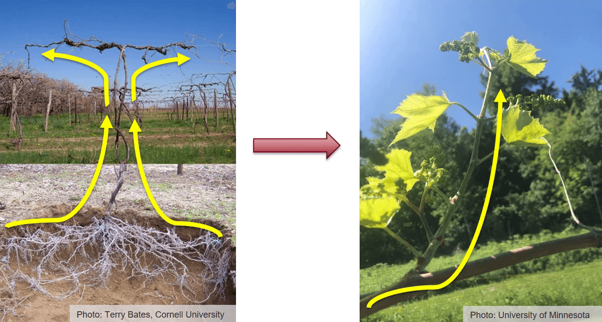](grapes-are-perennial-plants-they-stockpile-the-resources-over-the-winter.png)

First things first grapes are perennial plants. That means they keep growing every year and they go dormant in the winters.

In order to be perennial and come back every year they have to stockpile energy reserves each fall to use the next spring.

So when they start moving these resources into the new shoots and leaves in the spring this is called a source-sink relationship.

The roots and trunks are the source of nutrients and resources and the new shoots are the sinks that use up these resources in the spring.

A few weeks after bud break the winter stockpile of energy becomes depleted and the vine starts relying more on photosynthesis from the leaves to continue to develop their canopy.

Why does this matter? Well, the stockpile of energy comes from carbon and nutrients in the leaves and the canes that are accumulated the previous season.

So the vines need to have adequate nutrition and enough of a canopy the previous season in order to accumulate this stockpile for the winter.

If the vines weren't properly fertilized, had too big of a crop the previous year, or had an early freeze that killed the leaves there may be fewer of these reserves stored for the next season.

So it's important for the vines to have good fertility and the right balance of fruit and leaves to produce these stockpiles that enable the vines to grow rapidly the following year.

## 2. Grapes Take Cues from the Spring Weather to Break Dormancy

[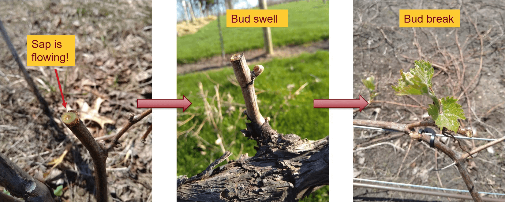](grapes-take-cues-from-the-spring-weather-to-break-dormancy.png)

Grapevines go dormant every winter and they need the heat in the spring to break that dormancy and start growing again.

So as temperatures warm in the spring the vines start to break their dormancy and slowly begin becoming active again.

The soil warms up the ambient humidity increases in the air and water is drawn up the trunk from the ground causing sap to flow.

The end of dormancy is marked by bud swell, when the buds grow in size.

Bud break follows bud swell and from there the buds grow very slowly into shoots.

Bud break is always much anticipated, and the timing of bud break is a big topic of conversation among grape growers in the spring.

The timing of bud break depends on the location of the vineyard and the variety, but it also depends hugely on the weather.

A certain amount of hours or days above freezing are required for vines to exit their dormancy.

The more warm spring days we have, the quicker bud break will occur.

The accumulation of days when plant growth processes can occur is called "growing degree" days.

You may hear this term periodically.

## 3. Grapevines Can Pollinate Themselves

[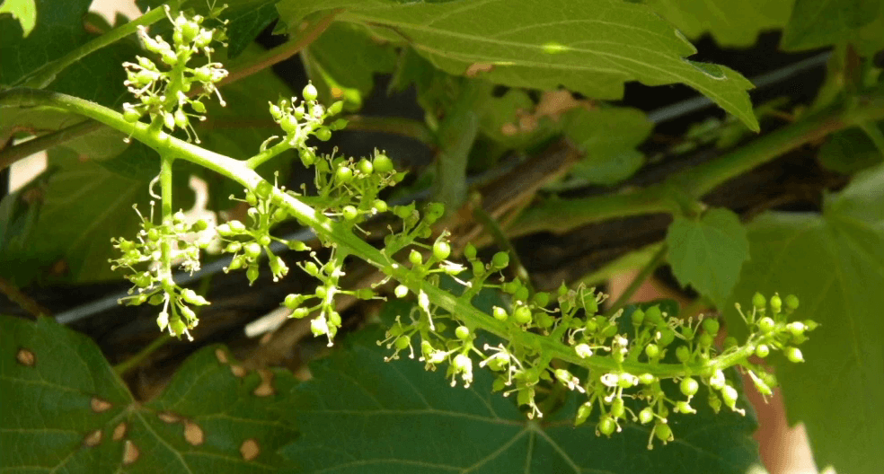](grapevines-can-pollinate-themselves.png)

Most cultivated grape varieties have what we call "perfect flowers", meaning the flowers have both male and female parts.

The plants self-pollinate because the pollen is able to fall from the male part of the flower onto the stigma, fertilizing itself without the need of a pollinating insect.

Bloom occurs a couple weeks after the initial bud break, typically mid-June in Minnesota.

These photos show what bloom looks like as the flower cap falls off revealing the stigma.

Weather events like rain, storms or high heat can interfere with self-pollination and can cause poor fruit set in grapes.

## 4. Berries Use Sunlight, Nutrients, And Water to Grow and Ripen

[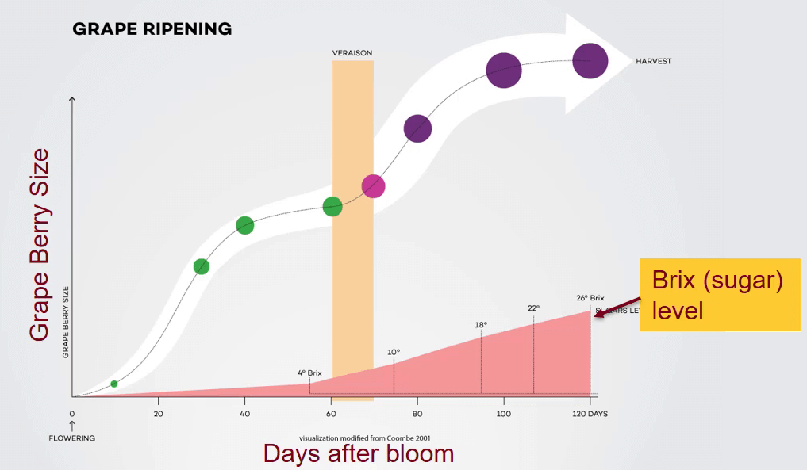](berries-use-sunlight-nutrients-and-water-to-grow-and-ripen.png)

After bloom the grapevines photosynthesize rapidly in order to grow leaves and allocate energy from those leaves into the development of the fruit.

The vines require a lot of sun, water and various nutrients like nitrogen potassium and phosphorus in order to ripen.

Fruit growth over the season is divided into three stages.

### Initial Growth Phase

Stage one starts at fruit set.

Right after bloom and lasts about 60 days.

During Stage One the berries form and then increase in size.

They accumulate acid and tannin, but do not accumulate much sugar.

Once the berries have reached about half their size (which in Minnesota is around late July) they pause their growth briefly for about five to ten days.

### Lag Phase

This is called Lag Phase (and is shown as the bright orange bar in this chart).

### Veraison Phase

Veraison occurs after the leg phase.

And at this point the berries begin to soften accumulate sugars and take on water.

This makes them increase to about twice their size.

The pink bar on this chart shows how Brix (or sugar levels) only start increasing in earnest at veraison.

## 5. Fruit Ripening Requires the Plant to Move Sugars & Nutrients from Leaves to Fruit

[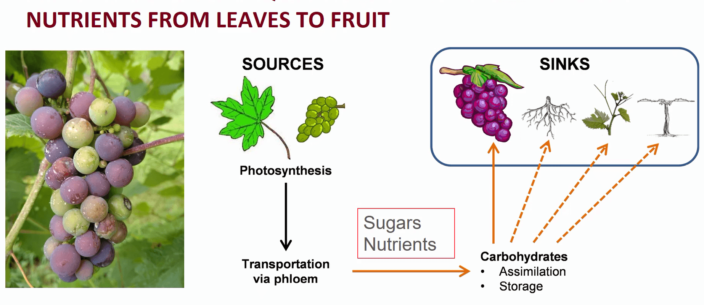](fruit-ripening-requires-the-plant-to-move-sugars--nutrients-from-leaves-to-fruit.png)

Veraison is a complex process where the green hard acidic berries begin to turn color and ripen.

What we see from the outside and what we can measure with simple tools is a change in color an increase in sugar and a decrease in acidity of the berries.

But what goes on behind the scenes within the berry is complex.

Tons of different genes are being expressed and repressed and biochemical processes within the plant shift to make these changes happen.

As the vine moves nutrients from the leaves into the fruit, sugars, tannins and flavor compounds form inside the berries.

They take on water, they soften and they increase a lot in size.

By the time the fruit is ripe it will be about 75 to 80 percent water.

So why do we care about this?

Well, because good wine is made in the vineyard.

Have you ever heard that phrase?

This saying in part refers to the beautiful flavor compounds tannins and sugars that form in the berries from veraison to harvest.

These flavor compounds and sugars are a result of the carbon and nutrients that move from the leaves to the fruit.

The way we manage our vines impacts how well these processes can happen.

## 6. Berries Need Plenty of Leaves to Ripen, But Too Many Can Shade Them

[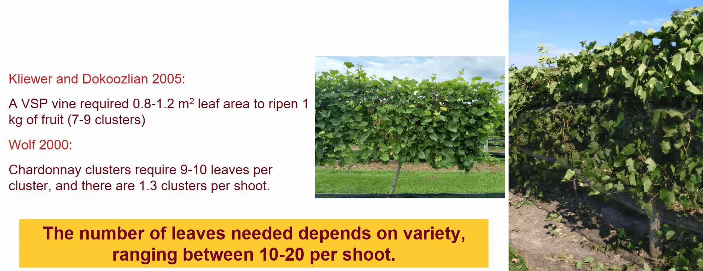](berries-need-plenty-of-leaves-to-ripen-but-too-many-can-shade-them-1.png)

Berries need plenty of leaves to ripen, but not too many.

It's hard to put a specific number on how many leaves are required to ripen a single grape cluster.

And there are multiple factors at play here.

This varies depending on the variety since some varieties ripen more easily than others and because some varieties have larger leaves than others.

Various studies and small experiments have looked at this question for specific scenarios.

For example a 2005 study found that vines on a vertical shoot positioning or VSP trellis shown here, needed about one square meter of leaf area to ripen one kilogram of grapes.

That one kilogram translates to roughly one square meter for about every six to nine clusters, depending on the variety.

Additionally Dr.Tony Wolf at Virginia Tech once calculated that Chardonnay vines at the Winchester Virginia research farm required 9 to 10 leaves to ripen each cluster.

Researchers at Cornell did an experiment to see just what would happen if they removed the leaves during the growing season.

This led to low yields, unripe fruit with low sugar and high acidity and serious winter injury the following winter.

These experiments further highlight the importance of good leaf canopy for ripening fruit and keeping the vines healthy for the coming season.

It's also important to note though that there is such a thing as too many leaves.

Keeping too much foliage on the vine can shade out the fruit and interfere with ripening.

It's all about balance.

This leads us to our next point.

## 7. Grapevines Rely on Us to Produce High Quality Fruit

[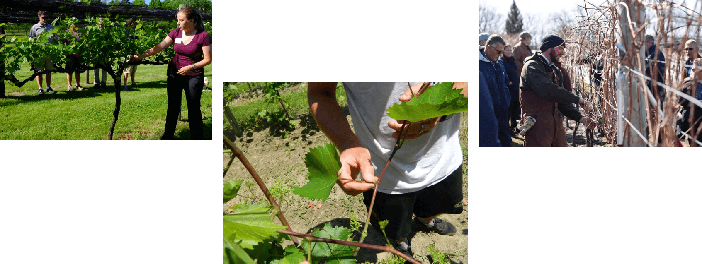](grapevines-rely-on-us-to-produce-high-quality-fruit.png)

Left to their own devices in nature grapevines will produce fruit, but it probably won't be the sweet complex delicious fruit that we want for wine.

If we want high quality fruit we have to help the vines do that for us.

A grapevine only has so much energy and it has to put a lot of that energy into producing fruit.

So if we let too many fruit clusters grow on the vines, or we leave way too many leaves, or shoots, that shade out the fruit, then the vine won't be able to properly ripen each cluster and the results will likely be less than desired.

There are several things that every good vineyard manager does to ensure a proper balance of energy between the grapevine's fruit and the leaf canopy.

### Dormant Pruning

The first one is dormant pruning.

It's absolutely essential to prune the vines every winter or early spring while they are dormant.

New growers take note as this is something you will need to make time for every year.

This involves removing most of the canopy and just leaving two to three buds on each cane which will then give rise to the next year's canes leaves and fruit.

We will cover this in depth later in the course.

### Shoot Thinning

Second canopy management technique is called shoot thinning.

Shoot thinning is done in the spring shortly after bud break when the shoots are between 4 and 11 inches long.

Shoot thinning involves removing some of the new shoots from the vine so that the vine only has to pour support a certain number of shoots or in other words canes in fruit clusters.

In the photo you see here on the left this is a vine before shoot thinning and on the right that shows that vine after shoot thinning.

### Leaf Removal

[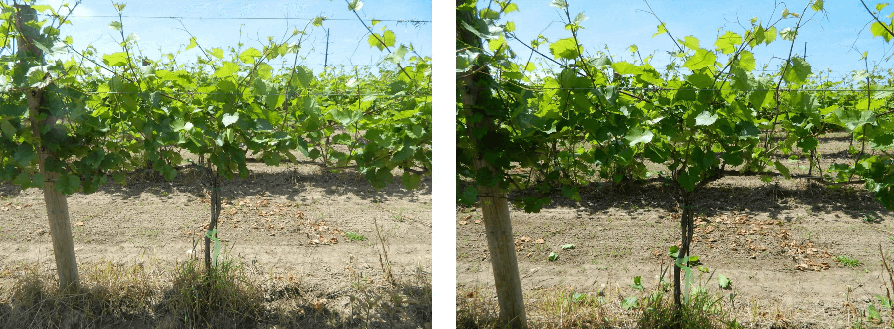](leaf-removal.png)

A third canopy management task is called leaf removal also called leaf pulling or leaf thinning.

This involves removing a small number of leaves just three to four from around the area of the clusters so there's more direct sunlight hitting the clusters.

This is done sometime between bloom and veraison.

As you can see here in this photo, the results can look a little bit subtle, but the photo on the left is a vine before leaf removal, and the photo on the right shows the vine after leaf removal.

We did this leaf removal right at bloom which is considered fairly early.

### Hedging

[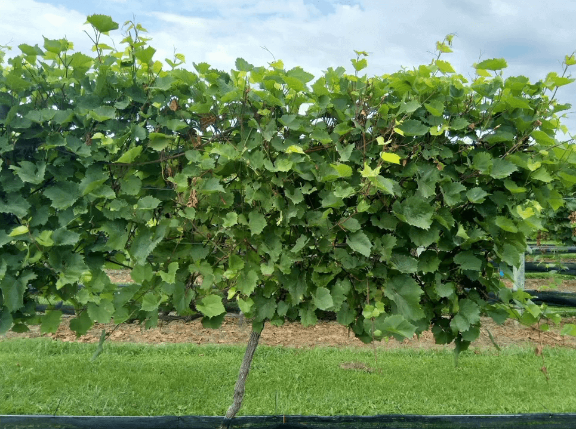](hedging.png)

Hedging is often done about two to three times per season depending on the vineyard and involves mechanically trimming off the tops or sides of the canopy to limit its growth.

These in-season canopy management practices will be covered later in the course with videos.

So don't be too worried if this wasn't quite enough information for you right now.

## 8. Diseases Attack Grapevines Early in the Season

This next slide has to do with disease management, which is a central part of growing grapes in our cold but humid climate.

We will take an in-depth look at disease management later in this course.

However, the big point to know now is that spraying fungicides for diseases in the early part of the season, starting in late April, or early May, is really important for preventing disease damage and yield losses later in the season.

Even though we can't actually see the problems caused by diseases in May or early June, the fungi that causes most of our major diseases is present then and should be carefully controlled, so as not to cause problems later.

In our climate this does involve the application of fungicides even on organic vineyards.

In this course we will be talking about how to do this sustainably and responsibly with the least possible impact on environmental and human health.

## 9. Grapevines Put Out New "Suckers" from the Ground Each Year

[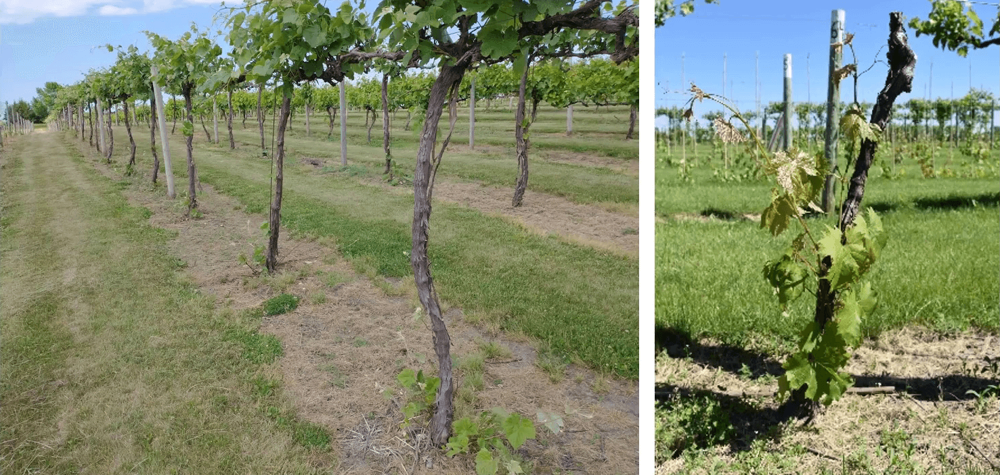](grapevines-put-out-new-suckers-from-the-ground-each-year.png)

Grapevines frequently grow up new shoots from the ground at the base of the plant.

These volunteer shoots are called "suckers".

Usually suckers are removed every year, we call this de-suckering.

We de-sucker so that the suckers don't steal energy and nutrients from the rest of the plant.

However in cold climate vineyards where extreme winter temperatures sometimes injure the vines suckers are an important tool.

Even when the top of a vine dies, the root systems are often still healthy and will still grow suckers, we can use these suckers to grow them into new grapevines.

That brings us to our last point.

## 10. They Get Cold

[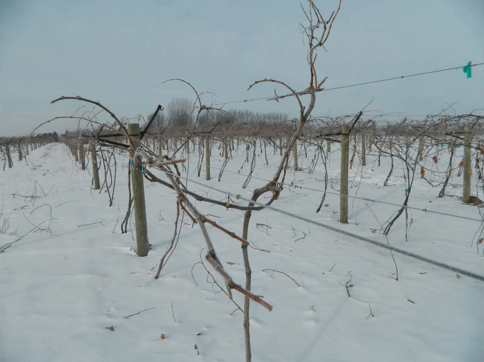](they-get-cold.png)

Growing grapes and cold climates comes with unique challenges related to our cold winters.

Grape growers in this climate know this and they're up for the challenge.

Vines can be injured by extreme winter temperatures and this is a normal part of growing grapes here.

Growers should expect to experience winter injury and know the best strategies for how to manage it and have a fruitful vineyard.

Again, we will be discussing this throughout the course.
